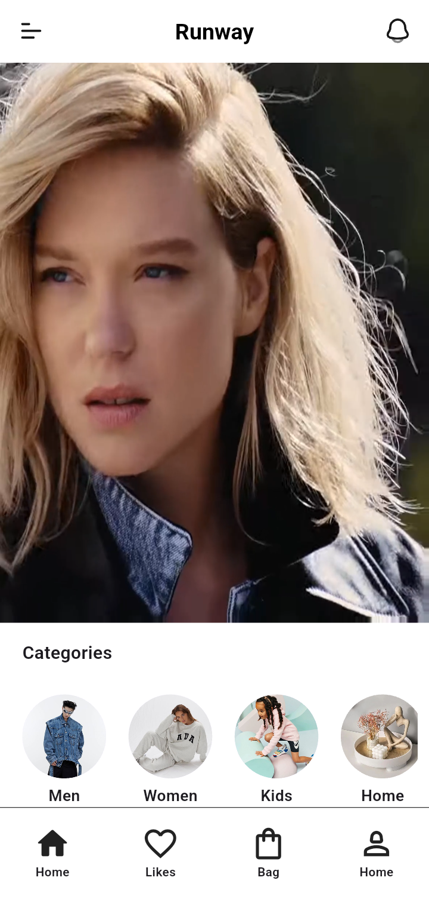
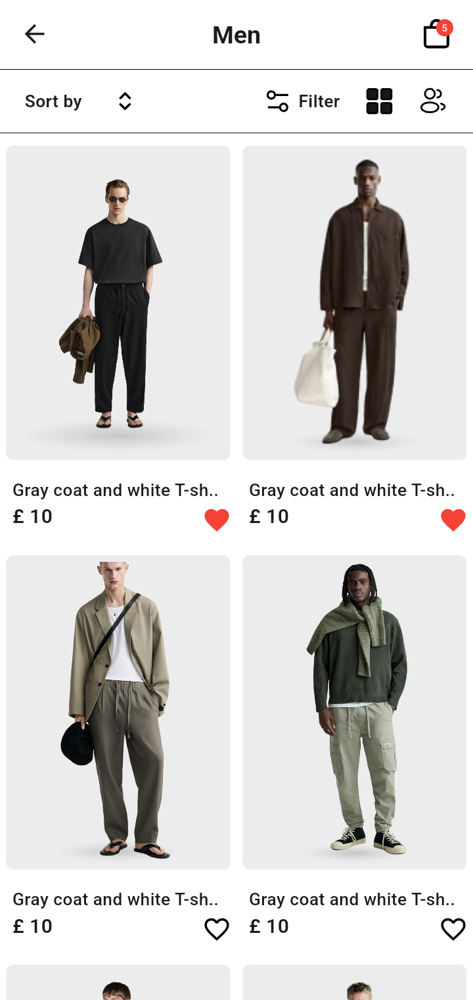
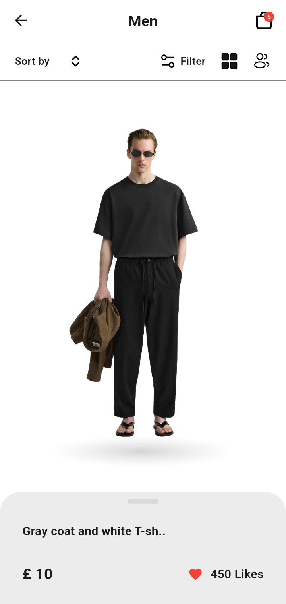
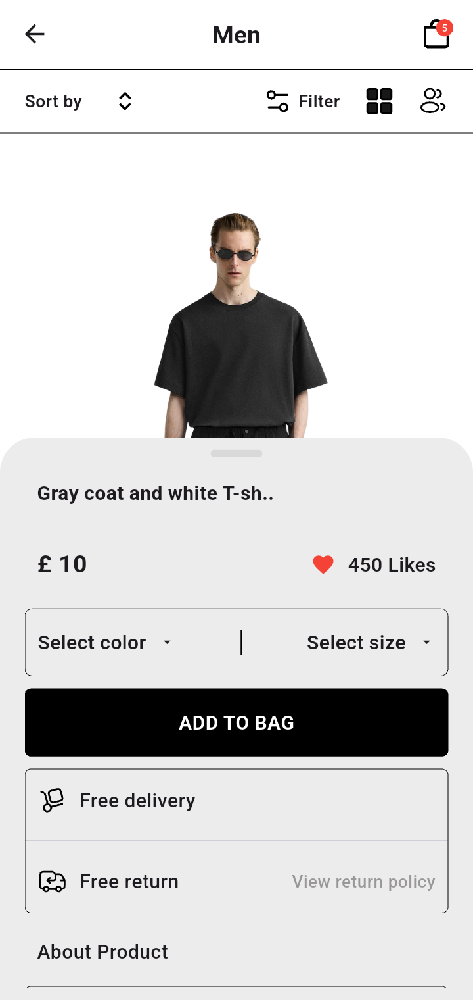
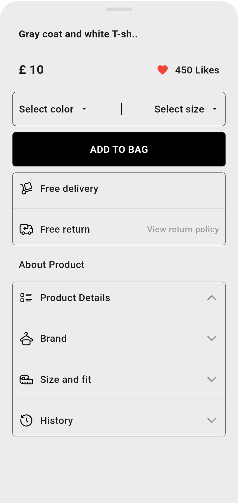

# Fashion Store App

A Flutter e-commerce UI application showcasing a modern fashion retail experience with video backgrounds, category browsing, and product details.

---

## Overview

Fashion Store App is a mobile application designed to demonstrate a fashion retail interface. The app provides users with an engaging shopping experience featuring a video background hero section, category-based browsing, and detailed product views.

**Target Audience:** Fashion retailers and developers looking for a Flutter e-commerce UI reference implementation.

**Key Capabilities:**
- Immersive video background on home screen
- Category-based product navigation
- Product detail views with interactive bottom sheets
- Favorites functionality
- Responsive grid layouts for product displays

---

## Features

### Home Screen
- Video background player with autoplay
- Animated splash screen with brand logo
- Horizontal scrolling category list
- Bottom navigation bar

### Categories
- Category grid with image thumbnails
- Category-based product filtering
- Horizontal category carousel on home screen

### Product Details
- Full-screen product image display
- Draggable bottom sheet with product information
- Price display with favorites toggle
- Color and size selection UI
- Add to bag functionality
- Free delivery and return policy information
- Expandable product details sections

### Navigation
- Custom app bar with leading/trailing widgets
- Bottom navigation bar with Home, Likes, Bag, and Profile tabs
- Back navigation support

---

## Tech Stack

| Technology | Details |
|------------|---------|
| **Framework** | Flutter |
| **Language** | Dart 3.10.4+ |
| **State Management** | StatefulWidget (setState) |
| **Routing** | Navigator 1.0 (MaterialPageRoute) |
| **Dependency Injection** | Not implemented |
| **Networking** | Not implemented |
| **Local Database** | Not implemented |
| **Local Storage** | Not implemented |
| **Secure Storage** | Not implemented |
| **Authentication** | Not implemented |
| **Video Playback** | video_player 2.11.1 |
| **SVG Rendering** | flutter_svg 2.3.0 |
| **Animations** | animate_do 5.1.0 |
| **Icons** | Cupertino Icons, Material Icons |
| **Code Generation** | Not implemented |
| **Testing** | flutter_test (widget tests) |
| **Linting** | flutter_lints 6.0.0 |

---

## Project Architecture

This project follows a simple screen-based architecture without a formal layered architecture pattern.

### Layer Responsibilities

**Screens Layer (`lib/screens/`)**
- Contains all full-page UI implementations
- Manages screen-level state and navigation
- Handles user interactions and routing between screens

**Widgets Layer (`lib/widget.dart/`)**
- Reusable UI components
- Custom app bar, product cards, and toolbar components
- Stateless and stateful widget implementations

**Models Layer (`lib/model/`)**
- Data models for categories and products
- In-memory data lists for demo content
- Simple model classes without persistence

**Main Entry (`lib/main.dart`)**
- Application initialization
- Theme configuration
- Root widget setup

### Data Flow
- Data flows from model definitions → screen widgets → custom widgets
- Navigation uses imperative Navigator.push/pop pattern
- No centralized state management or data layer

---

## Project Structure

```
lib/
├── main.dart                    # Application entry point
├── global_variable.dart         # Empty file (reserved for globals)
├── model/
│   └── model.dart               # Category and product data models
├── screens/
│   ├── splash.dart              # Animated splash screen
│   ├── home.dart                # Home screen with video and categories
│   ├── categories_screen.dart   # Category product grid
│   └── details.dart             # Product detail with bottom sheet
└── widget.dart/
    ├── custom_appbar.dart       # Reusable app bar component
    ├── cloth_card_widget.dart   # Product card widget
    └── tool_barWidget.dart      # Sort/filter toolbar

assets/
├── svg/                         # SVG icons and graphics
├── png/
│   ├── categories/              # Category images
│   ├── cloths/                  # Product images
│   └── models/                  # Model images
└── video/
    └── video1.mp4               # Background video

test/
└── widget_test.dart             # Default Flutter widget test

android/                         # Android platform configuration
ios/                             # iOS platform configuration (not analyzed)
web/                             # Web platform configuration
windows/                         # Windows platform configuration
linux/                           # Linux platform configuration
macos/                           # macOS platform configuration
```

### Directory Responsibilities

**`lib/screens/`** - Full-page UI screens that represent distinct app views. Each screen manages its own state and navigation logic.

**`lib/widget.dart/`** - Reusable UI components shared across screens. Includes custom app bar, product cards, and filter toolbar.

**`lib/model/`** - Data structures and demo data. Contains `CategoryModel` and `ClothModel` classes with in-memory lists.

**`assets/`** - Static resources including SVG icons, PNG images for categories/products, and video backgrounds.

---

## Prerequisites

- **Flutter SDK** >= 3.38.0
- **Dart SDK** >= 3.10.4 < 4.0.0
- **Android Studio** (for Android development)
- **Xcode** (for iOS development, macOS only)
- **CocoaPods** (for iOS dependencies, macOS only)
- **Git** (for version control)

---

## Installation

### Clone the Repository

```bash
git clone https://github.com/alwhali/Fashion-Store-App.git
cd fashion_store_app
```

### Install Dependencies

```bash
flutter pub get
```

### Run the Application

```bash
flutter run
```

---

## Build

The project supports building for multiple platforms:

```bash
# Android APK
flutter build apk

# Android App Bundle
flutter build appbundle

# iOS (requires macOS and Xcode)
flutter build ios

# Web
flutter build web

# Windows
flutter build windows

# Linux
flutter build linux

# macOS
flutter build macos
```

---

## Configuration

### Environment Variables
No environment variables or `.env` files are configured in this project.

### Firebase
Firebase is not configured in this project.

### Build Flavors
No build flavors are configured.

### API Configuration
No API endpoints or network configuration is present. The app uses local assets and in-memory data.

### Secrets Management
No secrets or sensitive configuration is present in the repository.

---

## Usage

### Starting the Project
1. Ensure Flutter SDK is installed and configured
2. Run `flutter pub get` to install dependencies
3. Run `flutter run` to launch the app on a connected device or emulator

### Adding a New Screen
1. Create a new Dart file in `lib/screens/`
2. Implement the screen as a `StatefulWidget` or `StatelessWidget`
3. Add navigation logic using `Navigator.push()` with `MaterialPageRoute`
4. Update the main app routing if needed

### Adding a New Widget
1. Create a new Dart file in `lib/widget.dart/`
2. Implement the widget as a `StatelessWidget` or `StatefulWidget`
3. Import and use the widget in screens as needed

### Adding Product Data
1. Open `lib/model/model.dart`
2. Add new `ClothModel` instances to the `cloths` list
3. Provide image path, description, price, and favorite status

### Adding Categories
1. Open `lib/model/model.dart`
2. Add new `CategoryModel` instances to the `categories` list
3. Provide category name and image path

### Adding Assets
1. Place images in `assets/png/categories/`, `assets/png/cloths/`, or `assets/png/models/`
2. Place SVGs in `assets/svg/`
3. Place videos in `assets/video/`
4. Ensure paths are declared in `pubspec.yaml` under `flutter/assets`

### Adding Dependencies
1. Add the dependency to `pubspec.yaml` under `dependencies` or `dev_dependencies`
2. Run `flutter pub get` to install

---

## Data Storage

This project does not implement persistent data storage. All data is stored in-memory:

- **Category Data:** In-memory `List<CategoryModel>` in `lib/model/model.dart`
- **Product Data:** In-memory `List<ClothModel>` in `lib/model/model.dart`
- **Favorites Status:** Stored in model objects (not persisted)
- **Video Asset:** Local asset file at `assets/video/video1.mp4`
- **Images:** Local asset files in `assets/png/` directories
- **Icons:** Local SVG assets in `assets/svg/`

No local database, shared preferences, secure storage, or Firebase integration is implemented.

---

## Assets

### Images
- **Category Images:** `assets/png/categories/` - Contains category thumbnail images (men, women, kids, home, deals)
- **Product Images:** `assets/png/cloths/` - Contains product images for clothing items
- **Model Images:** `assets/png/models/` - Directory exists but no files referenced in code

### Icons
- **SVG Icons:** `assets/svg/` - Contains 18 SVG files including:
  - Brand logos (Runway.svg, brand.svg)
  - UI icons (bar-chart-2.svg, solar_bell.svg, bagShop.svg)
  - Action icons (arrow_up_down.svg, chevron-down.svg, chevron-up.svg)
  - Feature icons (filter, grid, users, delivery, truck-return, history, product details, size and fit)

### Video
- **Background Video:** `assets/video/video1.mp4` - Used as hero background on home screen

### Asset Organization
All assets are declared in `pubspec.yaml` and loaded using Flutter's asset system. SVGs are rendered using `flutter_svg` package, images use `Image.asset()`, and video uses `video_player` package.

---

## Testing

### Test Framework
- **Framework:** flutter_test
- **Type:** Widget tests only

### Current Test Coverage
The project contains a default Flutter widget test (`test/widget_test.dart`) that tests a counter increment scenario. This test is not relevant to the actual application functionality.

### Running Tests
```bash
flutter test
```

### Test Implementation
No custom tests for screens, widgets, or models have been implemented. The existing test is a boilerplate template from Flutter project creation.

---

## Code Quality

### Linting
- **Tool:** flutter_lints 6.0.0
- **Configuration:** Uses default `package:flutter_lints/flutter.yaml` rules
- **Custom Rules:** No custom lint rules configured

### Static Analysis
Run the following command to perform static analysis:
```bash
flutter analyze
```

### Formatting
Flutter/Dart code formatting is enforced by default Dart formatter:
```bash
dart format lib/ test/
```

### Recommended Development Workflow
1. Make code changes
2. Run `flutter analyze` to check for issues
3. Run `dart format .` to format code
4. Run `flutter test` to verify tests pass
5. Run `flutter run` to test on device

---

## Performance Notes

### Verified Optimizations
- **Video Autoplay:** Video player initializes and plays automatically on home screen
- **Lazy Loading:** ListView.builder used for horizontal category list and product grid
- **Image Optimization:** Images use `BoxFit.cover` and `BoxFit.fitHeight` for efficient rendering
- **Widget Rebuilds:** StatelessWidgets used where possible to minimize rebuilds
- **Scroll Physics:** BouncingScrollPhysics applied to list views for smooth scrolling

### Not Implemented
- No caching strategy for network images (all assets are local)
- No pagination or infinite scrolling
- No image compression or WebP formats
- No code splitting or deferred loading

---

## Screenshots

### Splash Screen


### Home Screen


### Categories Screen



### Details Screen





**Suggested Screenshots:**
- Splash screen with animated logo
- Home screen with video background
- Categories horizontal list
- Product grid view
- Product detail screen with bottom sheet
- Bottom sheet expanded showing product information

---

## Roadmap

No roadmap or TODO documentation found in the repository.

---

## Known Limitations

- **No Persistence:** All data is in-memory and resets on app restart
- **No Networking:** No API integration or backend connectivity
- **No Authentication:** No user login or profile management
- **No State Management:** Uses basic setState without a formal state management solution
- **No Routing:** Uses Navigator 1.0 without a routing package
- **No Localization:** No multi-language support
- **No Dark Mode:** Only light theme is implemented
- **Placeholder Data:** All products and categories are hardcoded demo data
- **Non-functional UI Elements:** Sort, filter, likes, bag, and profile buttons are present but not functional
- **Default Test:** The widget test is a boilerplate counter test unrelated to app functionality

---

## FAQ

**Q: Is this a production-ready app?**
A: No, this is a UI demonstration project. It lacks backend integration, state management, persistence, and many functional features.

**Q: Can I use this for my e-commerce project?**
A: This can serve as a UI reference or starting point, but significant additions are needed for production use (networking, state management, authentication, payment integration, etc.).

**Q: Why is the test file showing a counter test?**
A: The test file is the default Flutter template and has not been updated to test the actual app functionality.

**Q: Does this app support iOS?**
A: Yes, the iOS platform configuration exists, but it has not been analyzed in detail. The app should run on iOS with standard Flutter setup.

---

## Contributing

Contributions are welcome! Please follow these guidelines:

### Workflow
1. Fork the repository
2. Create a feature branch (`git checkout -b feature/amazing-feature`)
3. Commit your changes (`git commit -m 'Add amazing feature'`)
4. Push to the branch (`git push origin feature/amazing-feature`)
5. Open a Pull Request

### Code Standards
- Follow Flutter/Dart style guidelines
- Run `flutter analyze` before submitting
- Ensure code is formatted with `dart format .`
- Write meaningful commit messages

### Code Review
- All submissions require code review
- Maintainers will review PRs for code quality and alignment with project goals
- Feedback will be provided for requested changes

---

## License

No LICENSE file found in the repository. This project currently has no license specified.

---

## Acknowledgments

### Frameworks and Libraries
- **Flutter** - UI framework for building natively compiled applications
- **video_player** - Video playback functionality
- **flutter_svg** - SVG rendering support
- **animate_do** - Animation utilities

### Design Resources
- SVG icons from various icon libraries (Solar Icons, Lucide, Ion Icons, Hugeicons)
- Product and category images (local assets)

---

## Contact

No contact information found in the repository.

**Repository:** https://github.com/alwhali/Fashion-Store-App.git
